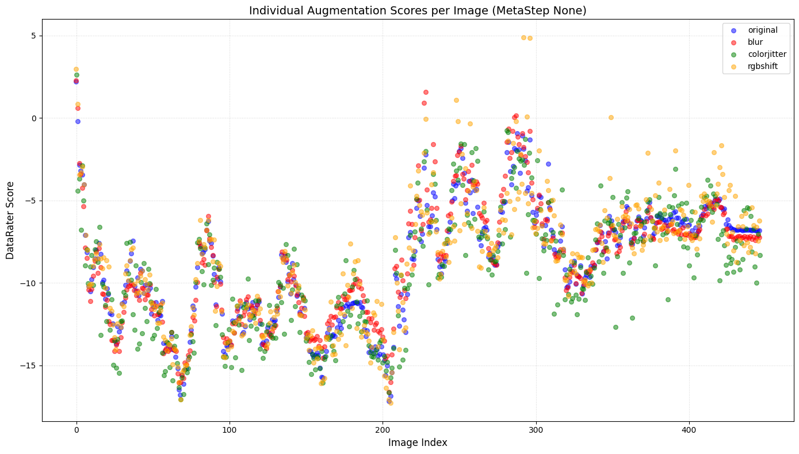
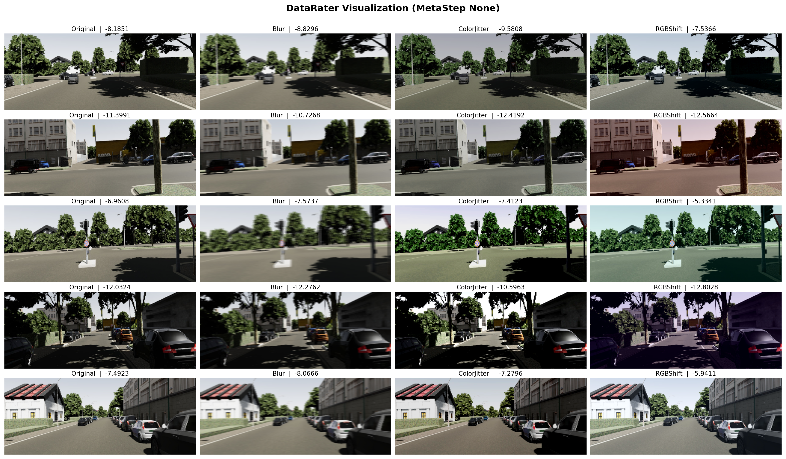
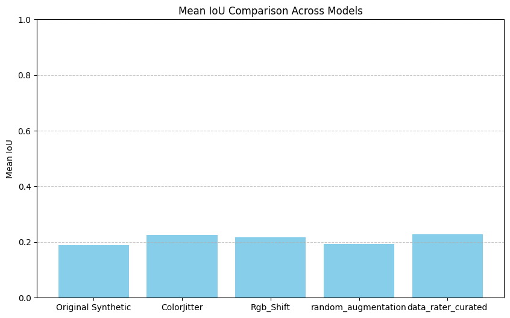

# Meta-Learning for Augmentation Selection in Synthetic-to-Real Transfer

This repository implements a meta-learning approach to automatically discover optimal data augmentations for improving model generalization from synthetic to real data. Using a [DataRater](https://arxiv.org/pdf/2505.17895) network trained via differentiable inner-loop optimization, we learn augmentation preferences that outperform random and equally-weighted augmentation strategies.

**Validated on**: Semantic segmentation with VKITTI→KITTI transfer

> **Note**: This code extends the [DataRater implementation](https://github.com/rishabhranawat/DataRater) from MNIST classification to dense prediction tasks (segmentation).

## Key Contributions

### 1. Dataset Pipeline
- Added `Seg2Dataset` for VKITTI → KITTI semantic segmentation
- Implemented RGB→class mapping for both datasets
- Supported augmentations: original, blur, colorjitter, rgbshift
- Standardized image resolution: 512×256

### 2. DataRater Architecture
- CNN-based architecture with progressive downsampling (Conv+BN blocks)
- Feature extraction: 32→64→128→256 channels
### 3. Meta-Learning Loop
**Inner loop:**
- Handles segmentation logits [B, C, H, W]
**Outer loop:**
- Validates on real KITTI data to measure generalization
### 4. Augmentation Selection Analysis
- `analyze_with_individual_augmentations()` evaluates all 4 augmentations per image
- Saves optimal augmentation choices to `best_augmentations_step_X.pt`
- 
**Learned Augmentation Preferences:**

### 5. Training & Visualization
- `visualize_samples_with_scores()` displays augmented samples with DataRater scores
- `train_k_top()` trains using each image's optimal augmentation
- Achieves improved VKITTI→KITTI transfer performance vs. random augmentation

## Results

see the included Jupyter notebook with examples and visualizations:  

